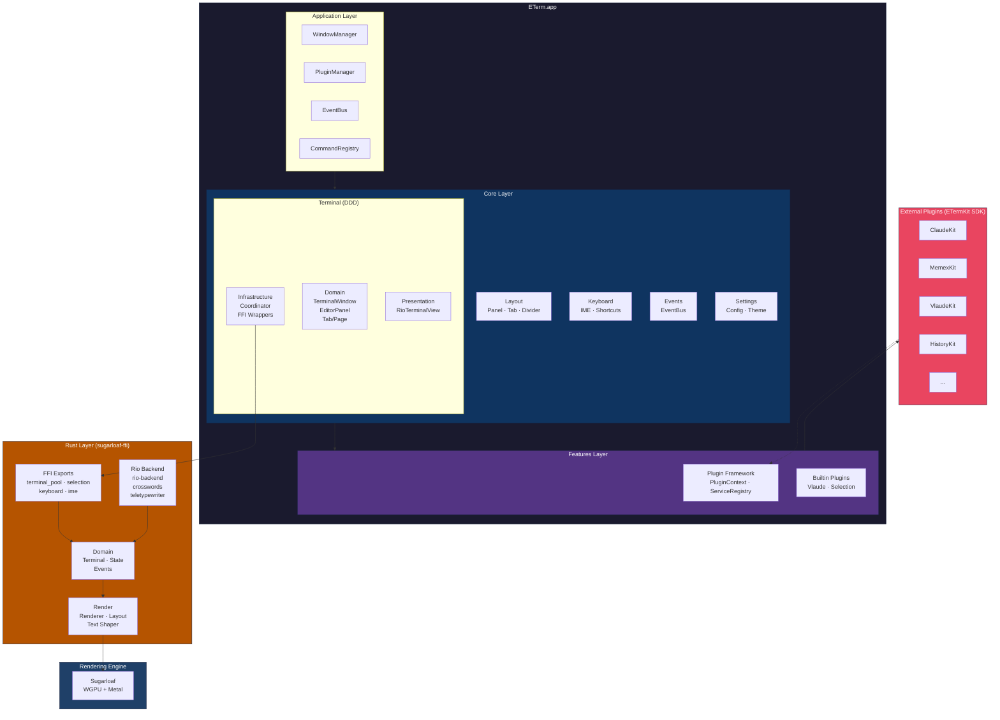
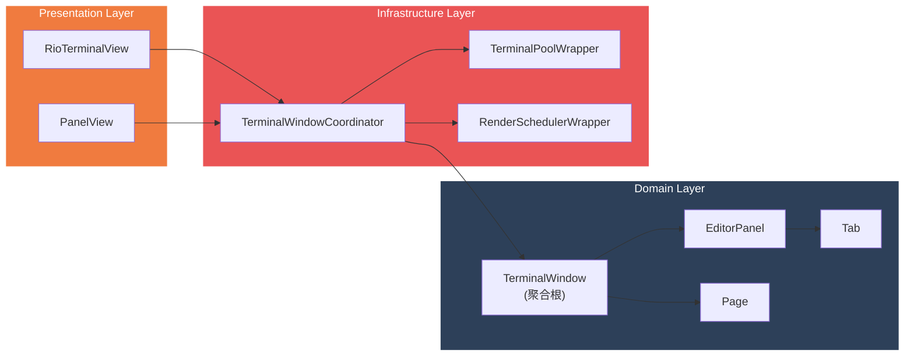
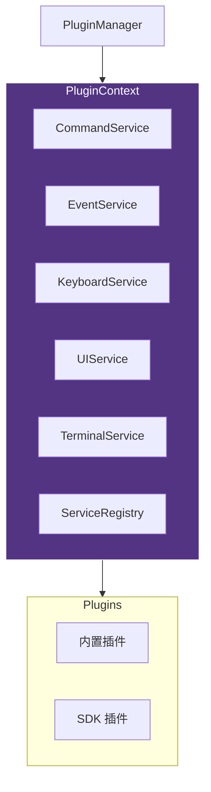
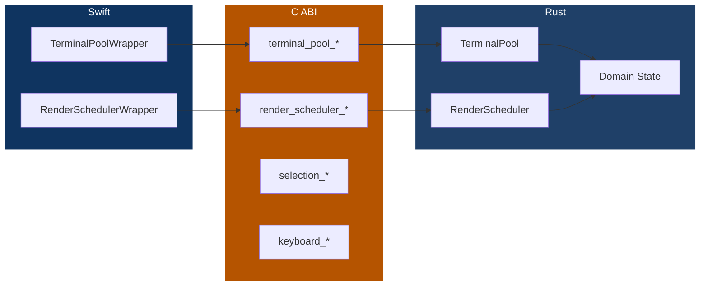
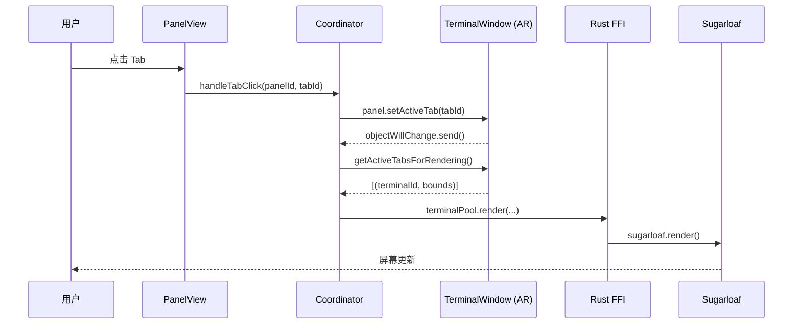
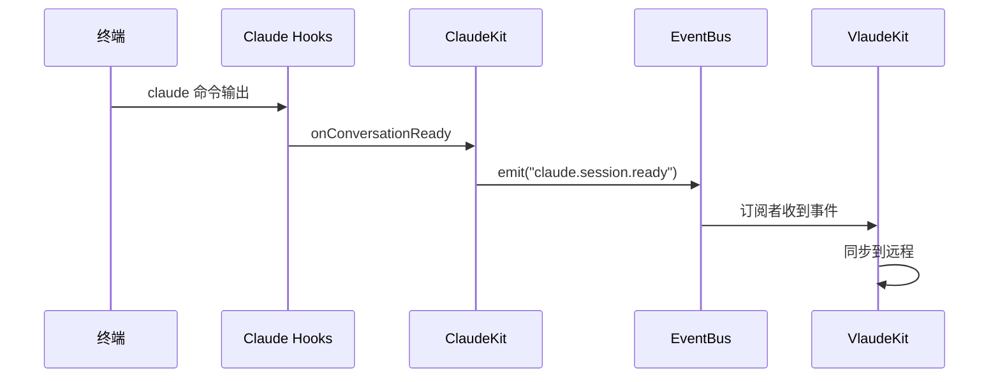

# ETerm 架构文档

> 最后更新: 2025-01-01

## 架构总览

ETerm 采用 **DDD（领域驱动设计）+ 插件化** 架构，核心设计原则：

1. **单向数据流** - Domain AR → Coordinator → UI → Rust 渲染
2. **插件优先** - 功能通过插件扩展，核心保持轻量
3. **FFI 隔离** - Swift 与 Rust 通过 C ABI 清晰分离

---

## 系统分层架构



---

## 目录结构

```
ETerm/
├── ETerm/
│   ├── Application/              # 应用层入口
│   │   └── ETermApp.swift
│   │
│   ├── Core/                     # 核心模块
│   │   ├── Terminal/             # 终端核心（DDD 架构）
│   │   │   ├── Domain/           # 领域层
│   │   │   │   ├── Aggregates/   # 聚合根（TerminalWindow, EditorPanel, Tab, Page）
│   │   │   │   ├── ValueObjects/ # 值对象（PanelLayout, SplitDirection）
│   │   │   │   ├── Services/     # 领域服务（LayoutCalculator, SessionManager）
│   │   │   │   └── Commands/     # 命令对象
│   │   │   ├── Infrastructure/   # 基础设施层
│   │   │   │   ├── Coordination/ # 协调器（TerminalWindowCoordinator）
│   │   │   │   ├── FFI/          # Rust FFI 封装
│   │   │   │   ├── Window/       # 窗口管理
│   │   │   │   └── DragDrop/     # 拖放处理
│   │   │   └── Presentation/     # 表现层
│   │   │       └── RioTerminalView.swift
│   │   │
│   │   ├── Layout/               # 布局系统
│   │   │   ├── Domain/           # Tab 模型
│   │   │   └── Presentation/     # Panel/Tab/Divider 视图
│   │   │
│   │   ├── Keyboard/             # 键盘处理
│   │   │   ├── IME/              # 输入法
│   │   │   ├── Handlers/         # 按键处理器
│   │   │   └── Configuration/    # 快捷键配置
│   │   │
│   │   ├── Events/               # 事件系统
│   │   ├── Settings/             # 设置管理
│   │   └── Shared/               # 共享组件
│   │
│   ├── Features/                 # 功能模块
│   │   ├── Plugins/              # 插件系统
│   │   │   ├── Framework/        # 插件框架
│   │   │   │   ├── PluginManager.swift
│   │   │   │   ├── PluginContext.swift
│   │   │   │   └── ServiceRegistry.swift
│   │   │   ├── Core/             # 核心命令引导
│   │   │   ├── ExtensionHost/    # SDK 插件宿主
│   │   │   └── [内置插件]/
│   │   └── MCP/                  # MCP 协议支持
│   │
│   └── Resources/                # 资源文件
│
├── Plugins/                      # 外部插件（ETermKit SDK）
│   ├── ClaudeKit/                # Claude 会话感知
│   ├── MemexKit/                 # 历史搜索
│   ├── VlaudeKit/                # 远程控制
│   ├── HistoryKit/               # 历史记录
│   └── .../
│
├── Packages/                     # Swift Packages
│   └── PanelLayoutKit/           # 布局计算库
│
└── rio/                          # Rust 终端后端
    └── sugarloaf-ffi/            # FFI 桥接层
        ├── src/
        │   ├── ffi/              # C ABI 导出
        │   ├── domain/           # 领域模型
        │   ├── render/           # 渲染管线
        │   ├── app/              # 应用逻辑（TerminalPool）
        │   └── infra/            # 基础设施
        └── docs/
```

---

## 核心模块

### 1. Terminal (DDD 架构)

终端核心采用领域驱动设计，分为三层：



**核心聚合根**：

| 聚合根 | 职责 |
|--------|------|
| `TerminalWindow` | 窗口状态、Page 管理、焦点跟踪 |
| `EditorPanel` | Panel 布局、Tab 管理、分割树 |
| `Tab` | 终端标签、rustTerminalId、标题 |
| `Page` | 页面容器、根 Panel |

**数据流**：

```
用户操作 → Coordinator → AR 修改状态 → objectWillChange → UI 重绘 → Rust 渲染
```

### 2. Plugin Framework

插件系统提供完整的扩展能力：



**插件能力**：

| 服务 | 能力 |
|------|------|
| `CommandService` | 注册/执行命令 |
| `EventService` | 发布/订阅事件 |
| `KeyboardService` | 绑定快捷键 |
| `UIService` | 注册侧边栏、Tab Slot、Page Slot |
| `TerminalService` | 向终端写入数据、查询状态 |
| `ServiceRegistry` | 插件间能力共享 |

**插件类型**：

| 类型 | 位置 | 加载方式 |
|------|------|----------|
| 内置插件 | `Features/Plugins/` | 编译时链接 |
| SDK 插件 | `Plugins/*/` | 动态加载 (.bundle) |

### 3. Rust FFI Layer

Swift 与 Rust 通过 C ABI 通信：



**FFI 模块**：

| 模块 | 职责 |
|------|------|
| `terminal_pool.rs` | 终端生命周期、输入输出 |
| `selection.rs` | 文本选择 |
| `keyboard.rs` | 按键事件 |
| `ime.rs` | 输入法 |
| `cursor.rs` | 光标状态 |
| `render_scheduler.rs` | 渲染调度 |

---

## 数据流

### 终端渲染流程



### 插件事件流程



---

## 技术栈

| 层级 | 技术 |
|------|------|
| UI 框架 | SwiftUI + AppKit |
| 渲染引擎 | Sugarloaf (WGPU + Metal) |
| 终端后端 | Rio (crosswords + teletypewriter) |
| FFI | Rust cdylib (C ABI) |
| 插件 SDK | ETermKit (Swift Package) |

---

## 设计决策

### 1. 为什么用 DDD？

**问题**：传统 MVVM 导致状态分散、回调满天飞、难以追踪变化。

**解决**：
- 聚合根是唯一状态来源
- Coordinator 协调，不持有状态
- 单向数据流，变化可追踪

### 2. 为什么插件优先？

**问题**：功能堆砌导致核心臃肿、难以维护。

**解决**：
- 核心只提供基础能力（终端渲染、布局、事件）
- 所有功能通过插件实现
- 用户按需安装

### 3. 为什么 FFI 用 C ABI？

**问题**：Swift 和 Rust 直接互调复杂、不稳定。

**解决**：
- C ABI 是最稳定的跨语言接口
- 清晰的边界，易于调试
- 两边可以独立演进

---

## 相关文档

- [README.md](./README.md) - 项目概述和快速开始
- [../Plugins/PLUGIN_SDK.md](../Plugins/PLUGIN_SDK.md) - 插件开发指南
- [docs/COORDINATE_SYSTEM_ANALYSIS.md](./docs/COORDINATE_SYSTEM_ANALYSIS.md) - 坐标系分析
- [rio/sugarloaf-ffi/docs/ARCHITECTURE_render_pipeline.md](../rio/sugarloaf-ffi/docs/ARCHITECTURE_render_pipeline.md) - 渲染管线架构

---

## 附录：DDD 重构细节

> 以下是终端核心从 MVVM 重构到 DDD 的技术细节。

### 聚合根增强

#### TerminalTab
- 新增 `rustTerminalId: UInt32?` - 持有终端 ID
- 新增 `setRustTerminalId(_:)` - 设置终端 ID

#### EditorPanel
- 新增 `bounds: CGRect` - 持有位置和尺寸
- 新增 `updateBounds(_:)` - 更新位置
- 新增 `getActiveTabForRendering(headerHeight:)` - 获取激活 Tab

#### TerminalWindow
- 核心方法 `getActiveTabsForRendering(containerBounds:headerHeight:)` - 收集渲染数据
- 内部方法 `updatePanelBounds(containerBounds:)` - 更新所有 Panel bounds
- 内部方法 `calculatePanelBounds(layout:availableBounds:)` - 递归计算布局

### 架构对比

**旧架构（MVVM 回调）**：
- 三套模型并存
- 状态分散，数据流双向
- 回调满天飞

**新架构（DDD 单向数据流）**：
- AR 是唯一状态来源
- UI 无状态，只显示和捕获输入
- 数据流单向：AR → Coordinator → UI

### 渲染流程

```swift
// 1. 用户输入 → Coordinator 调用 AR 方法
coordinator.handleTabClick(panelId: panelId, tabId: tabId)

// 2. AR 修改状态
panel.setActiveTab(tabId)

// 3. 触发渲染
renderView.requestRender()

// 4. 从 AR 拉取数据
let tabsToRender = terminalWindow.getActiveTabsForRendering(...)

// 5. 调用 Rust 渲染
for (terminalId, contentBounds) in tabsToRender {
    terminalPool.render(terminalId: terminalId, ...)
}
sugarloaf.render()
```
